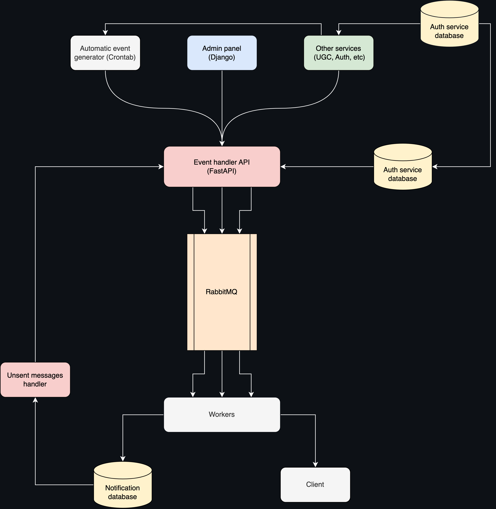

# Notification Service

The Notification Service is a versatile system for managing and sending notifications to users. Simplify your
notification process and improve your user engagement with the Notification Service.

---
Architecture scheme



---

## Features:

- Django Admin panel for easy management of notifications
- FastAPI API for sending and receiving notifications
- RabbitMQ for reliable message queuing and delivery
- Crontab schedule for automated notification sending
- Worker for handling notification sending in the background
- Unsent message handler for managing failed notifications
- Customizable notification templates
- Web-based interface for managing and customizing notifications
- Easy integration with other systems and applications

## Project initialization

1. Create an .env file and fill it with values from `env.example`
2. Run Docker
```console
 docker-compose up --build
```

## API

Main API:

- `$HOST:8001/api/v1/`

Admin Panel:

- `$HOST:8000/admin`

For more detailed usage and API documentation, please refer to

- `$HOST/api/openapi/`

## Team

Notification Service is the result of a talented and dedicated team of developers who work together to deliver a
high-quality service. Each member brings unique skills and expertise to the project, contributing to its success.

<details>
<summary>Berupor</summary>

---
Berupor is a skilled developer with expertise in FastAPI, Django Admin, and RabbitMQ. He is responsible for building the
core notification system, as well as developing and maintaining tests to ensure reliable delivery.
</details>

<details>
<summary>Mburdonos</summary>

---
Mburdonos is an experienced developer with a passion for automation and optimization. He takes care of the crontab schedule for automated notification sending, the worker for handling notifications in the background, and integrating the system with ClickHouse for efficient data storage and analysis.
</details>

<details>
<summary>Nikita</summary>

---
Nikita is a data specialist with a keen eye for detail. He takes care of the unsent message handler, ensuring that all
failed notifications are properly managed and addressed. Additionally, he is responsible for integrating the system with
PostgreSQL for seamless data management and retrieval.
</details>

